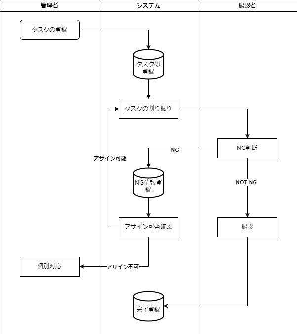

# 要件定義

## 一言コンセプト

速く簡単に

## 誰のどんな課題を解決するのか？

仕事割り振りがいろいろな条件を考慮する必要があり、難しい。また、NGなどやその時々の状況によって差し戻しなどが発生し管理が複雑化するのでそれを簡略化する。  

### 現行の仕事内容

1. PDFの入手
2. PDFに番号を振る
3. PDFを地域ごとに分ける
4. すでにアサインしているタスクの量を考慮しつつ撮影班に振り分ける
5. 振り分けをスプレッドシートに入力
6. NGが来たらスプレッドシートを修正
7. 再度振り分ける

### 自動化できる仕事

上記の4から7を自動化する。

## なぜそれを解決したいのか？

1. 割り振りは既定の条件を組み合わせて行う必要があり、そのタスクはコンピュータ向けであるあから。
2. 自動化することでほかの業務に時間を使うことができるようになるため。
3. 毎日行う業務であるため自動化のインパクトが大きい。
4. 一日あたり１時間かかるため自動化できると１週間で１日分の節約になるため。
5. 振り分けと記録を別々に行うため、２度手間が発生して負担になっている。

## どうやって解決するのか？

仕事の割り振りをロジックとして整理し、自動的にアサインできるようにする。また、割り振りとタスクの完了に関する情報を同じアプリ内で管理することで業務の管理を一括化し、簡略化する。

## 機能要件

- 仕事に属性を付与して、その属性を参照して割り振れるようにする。
- また、個人のキャパを把握しそれに溢れないように割り振るようにする。
- 割り振りに重みづけをできるようにする。
- 割り振られた仕事にNGを出せるようにして、そのNGに対してもうまく対応できるようにする。
- タスクに対して、コメントなどを追加できるようにする。
- 全部NGになった時の挙動を作る。
- アカウントは仕事を振る側と振られる側の２種類用意する。
- 振られる側については、すべてのタスクにアクセスすることができない。
- アサインされた仕事についてのみアクセスすることができるようにする。
- アサインする側のアカウントからはすべてのタスクにアクセスることができるようにする。
- タスクにはNGした、アカウントの情報などを保存しておく必要があるが、それは管理者側のアカウントからしかアクセスできないようにする。
- 非管理者アカウントの統計情報を参照できるようにする。
- 統計情報は、アサインから完了までの平均日数、NG率、１日当たりの遂行数など。

## 非機能要件

見やすいUI

高速で動くようにする

スマフォで機能させることも考えて作る

## 業務フロー

コア機能の業務フロー  
