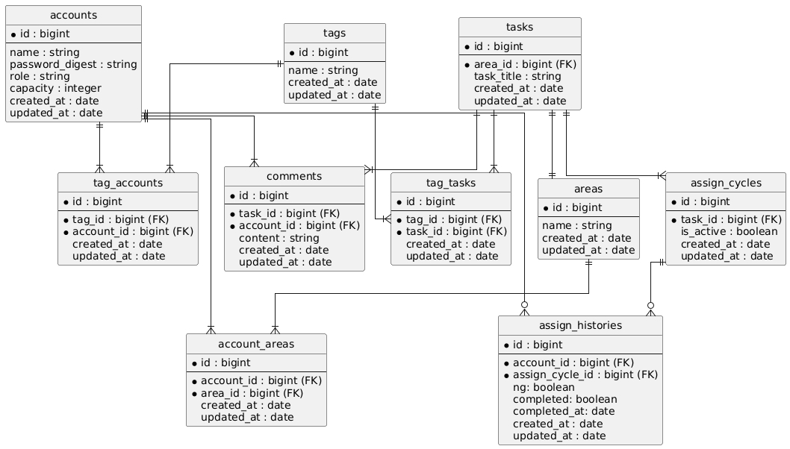
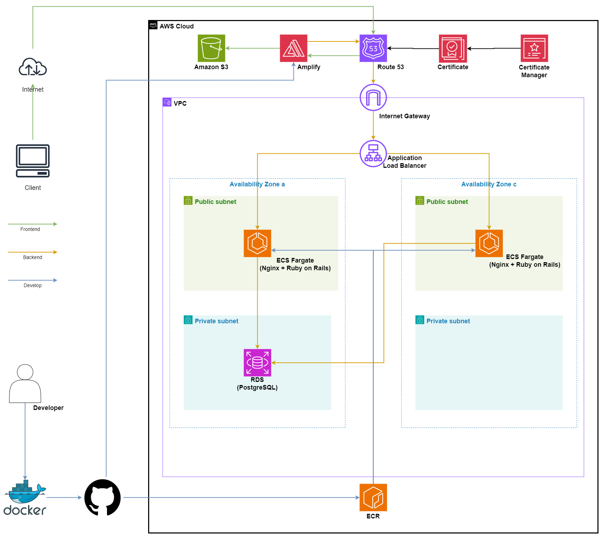

# Photo-in

撮影タスクを自動的に割り振るアプリ

- [フロントエンド](https://github.com/pandaFive/photo-in-frontend)
- [バックエンド](https://github.com/pandaFive/photo-in-backend)

## サービスURL

https://photo-in-app.com/

### アドミンアクセス

#### Account name
管理者

#### password
password

### メンバーアクセス

#### Account name
鈴木、高木、佐藤　など

#### password
password

## 概要

タスクの概要が書かれたPDFをアップロードすることで、file名に含まれる分類に従ってタスクを自動的に割り振るアプリケーション。

## 開発のきっかけ・背景

&emsp;1日に数十件の撮影タスクを、単純な条件に基づいて数人のスタッフに割り振る作業があります。この作業は、スタッフごとのキャパシティや撮影可能なエリア、物件の属性などいくつかの条件を参考にして割り振り先を決めていました。また、割り振りと記録の作業は別々に行われていたため、記録漏れや記録の誤りが発生するリスクがありました。1日に数十件を処理するこの一連の作業は煩雑であり、改善の余地がありました。  
&emsp;そこで、単純な条件を組み合わせて複数の処理を高速に行い、記録を自動的に保存するこの作業はコンピューターに任せるのが最適だと判断し、本アプリを作成しました。

## ユーザーの課題

- 1日20件～30件のタスクを条件ごとに個別に割り振る苦労
- 記録が手作業であり、記録漏れや記録の誤りが起こりやすい

## 使用技術

- Frontend: Next.js (eslint/prettier)
- Backend: Ruby on Rails (API mode/Rspec/rubocop ) + Nginx
- Infrastructure: AWS (Amplify/ECS Fargate/ECR/RDS/ALB/Route53), Docker & docker-compose & Dev Container
- Database: PostgreSQL

### 使用言語

- Ruby 3.3.0
- TypeScript

### Frontend (Next.js)

- aws-sdk
- mui
- eslint
- prettier
- jest

### Backend (Rails + Nginx)

- puma
- jwt
- rubocop
- rspec-rails
- factory_bot_rails

### Infrastructure

- Docker/docker-compose
- AWS
  - Frontend
    - Amplify
  - Backend
    - ECS Fargate
    - ECR
    - ALB
    - Route53
    - RDS(PostgreSQL)
  - Storage
    - S3
  - Other
    - ACM

### CI

- GitHub Actions

### Others

- Git, GitHub

## ER図

ER図  

## インフラ構成図

インフラ構成図  

## 機能一覧

### Member側機能

#### ログイン機能

- jwtを用いたログイン

#### アサインタスク確認機能

- アサインされたタスクを一覧表示
- PDFのURLを取得しPDFを表示する機能
- アサインされたタスクをNGする機能
- アサインされたタスクの完了登録する機能
- タスクにコメントを登録する機能
- アサインされたタスクをエリアかアサイン日でソートする機能

### Admin側機能

#### ログイン機能

- jwtを用いたログイン

#### ダッシュボード

- タスク登録機能
- 完了タスクチャート表示
- 日達成タスク数表示機能
- member簡易データ表、表示

#### member管理

- アカウント登録機能
- アカウント削除機能
- member 詳細表示機能

#### タスク管理

- NGされたタスクの再アサイン機能
- タスクのコメント登録機能
- PDFのURLを取得しPDFを表示する機能
- タスクのソート機能
- NGタスクの抽出機能

## 工夫

1. データベースの効率化

- 正規化
- `account_areas`などの中間テーブルを用いた最適化

2. ユーザビリティ

- 表やチャート、グラフを用いたデータの可視化
- インタラクティブなUI
- 一画面内の要素数の削減

3. GitHub Actions

- GitHub Actionsを用いたCIの構築
- push前のテスト通過の必須化

4. セキュリティ

- APIへの通信を行う関数をserverサイド
- AWSのセキュリティグループを用いたアクセス制限

5. 開発環境

- Dockerを用いてコンテナ化
- Dev Containerによる開発環境の作成

